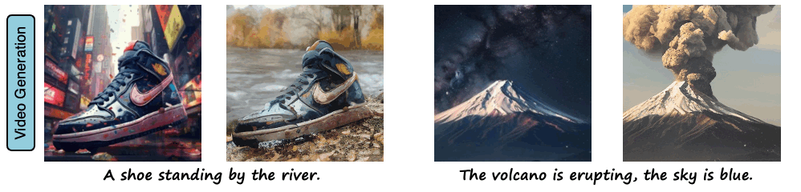
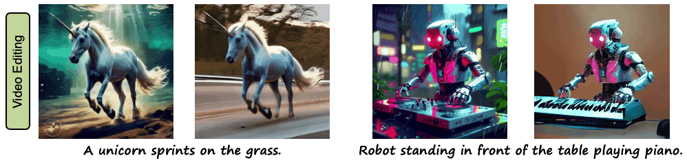

<p align="center">

  <h2 align="center">MagDiff: Multi-Alignment Diffusion for High-Fidelity Video Generation and Editing</h2>
  <p align="center">
    <a href="https://scholar.google.com/citations?user=pCGM7jwAAAAJ&hl=zh-CN&oi=ao"><strong>Haoyu Zhao</strong></a>
    ·
    <a href="#"><strong>Tianyi Lu</strong></a>
    ·
    <a href="https://scholar.google.com/citations?user=FjBhxhkAAAAJ&hl=zh-CN&oi=ao"><strong>Jiaxi Gu</strong></a>
    ·
    <a href="https://scholar.google.com/citations?user=dG46Q8wAAAAJ&hl=zh-CN"><strong>Xing Zhang</strong></a>
    ·
    <a href="https://scholar.google.com.hk/citations?user=l0Y7emkAAAAJ&hl=zh-CN&oi=sra"><strong>Qingping Zheng</strong></a>
    ·
    <a href="https://scholar.google.com.hk/citations?user=7t12hVkAAAAJ&hl=zh-CN&oi=ao"><strong>Zuxuan Wu</strong></a>
    ·
    <a href="https://scholar.google.com.hk/citations?user=J_8TX6sAAAAJ&hl=zh-CN&oi=ao"><strong>Hang Xu</strong></a>
    ·
    <a href="https://scholar.google.com.hk/citations?user=f3_FP8AAAAAJ&hl=zh-CN&oi=ao"><strong>Yu-Gang Jiang</strong></a>
    <br>
    <br>
        <a href="https://arxiv.org/abs/2311.17338"></a>
        <a href='https://gulucaptain.github.io/MagDiff/'></a>
    <br>
    <b>Fudan University &nbsp; | &nbsp;  Huawei Noah's Ark Lab</b>
  </p>

<table align="center">
    <tr>
    <td>
      <div align=center>
    </td>
    </tr>
    <tr>
    <td>
      <div align=center>
    </td>
    </tr>
  </table>

## 📢 News
* **[2024.12.22]** Release inference code. We are working to improve MagDiff, stay tuned!
* **[2024.07.04]** Our paper has been accepted by the 18th European Conference on Computer Vision (ECCV) 2024.
* **[2023.11.29]** Release first paper version on Arxiv.

## 🏃‍♂️ Getting Started
Download the pretrained base models for [StableDiffusion V2.1](https://huggingface.co/stabilityai/stable-diffusion-2-1-base).

Download our MagDiff [checkpoints](https://huggingface.co/).

Please follow the huggingface download instructions to download the above models and checkpoints.

Below is an example structure of these model files.

```
assets/
├── MagDiff.pth
└── stable-diffusion-2-1-base/
    ├── scheduler/...
    ├── text_encoder/...
    ├── tokenizer/...
    ├── unet/...
    ├── vae/...
    ├── ...
    └── README.md
```

## ⚒️ Installation
prerequisites: `python>=3.10`, `CUDA>=11.8`.

Install with `pip`:
```bash
pip3 install -r requirements.txt
```

## 💃 Inference
Run inference on single GPU:
```bash
bash inference.sh
```

## 🎓 Citation
If you find this codebase useful for your research, please use the following entry.
```BibTeX
@inproceedings{zhao2024magdiff,
    author    = {Zhao, Haoyu and Lu, Tianyi and Gu, Jiaxi and Zhang, Xing and Zheng, Qingping and Wu, Zuxuan and Xu, Hang and Jiang Yu-Gang},
    title     = {MagDiff: Multi-Alignment Diffusion for High-Fidelity Video Generation and Editing},
    booktitle = {European Conference on Computer Vision},
    year      = {2024}
}
```